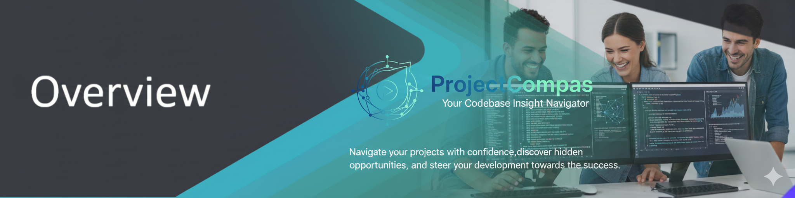

# ProjectCompass

**Analysis catalog, execution engine, and data exploration platform.**



ProjectCompass is a Python-based tool for teams that produce data analyses. It solves three problems that emerge after the analytical work is done:

1. **Organization** — a tag-based catalog of all analyses with metadata, documentation, and version tracking
2. **Execution** — a unified environment to run structured analyses consistently, with scheduling
3. **Exploration** — SQL queries on local datasets via DuckDB, with visualization and LLM-powered chat

---

## Features

| Feature | Description |
|---------|-------------|
| 📂 **Catalog** | Tag-based analysis repository with search, filter, and pagination |
| 🔍 **Data Explorer** | SQL queries on CSV/SQLite via DuckDB |
| 📊 **RAWGraphs Visualization** | Custom chart builder with 30+ chart types, drag-and-drop mapping, visual options, SVG/PNG export |
| ⚙️ **Execution Engine** | Run structured analyses with dynamic forms and physical outputs |
| ⏰ **Scheduler** | Schedule analyses with cron/interval triggers (APScheduler + SQLite persistence) |
| 🤖 **AI Chat** | Ask questions about your data in natural language (Ollama) |
| 🔗 **REST API** | JSON endpoints for all catalog, data, and query operations |
| 🐳 **Docker** | One-command deployment with Ollama LLM service |

---

## Quick Start with Docker

The fastest way to run ProjectCompass — no cloning or building required:

```bash
# Download the compose file
curl -O https://raw.githubusercontent.com/GiacomoSaccaggi/ProjectCompass/main/docker-compose.public.yml

# Start
docker compose -f docker-compose.public.yml up -d

# Open browser
open http://localhost:8080
```

To enable AI chat (optional):
```bash
docker exec ollama ollama pull qwen3:0.6b
docker exec ollama ollama pull nomic-embed-text
```

To update to the latest version:
```bash
docker compose -f docker-compose.public.yml pull
docker compose -f docker-compose.public.yml up -d
```

---

## Local Development

```bash
git clone https://github.com/GiacomoSaccaggi/ProjectCompass.git
cd ProjectCompass
uv sync

cp .env.example .env
# Edit .env with your settings

uv run python app.py
```

The app is available at `http://127.0.0.1:5000`

### Running Tests

```bash
uv run pytest -v
```

### Linting

```bash
uv run ruff check .
uv run ruff check --fix .  # auto-fix
```

---

## Docker (Development)

To build and run from source:

```bash
docker compose up -d
```

This uses `docker-compose.yml` which builds the image locally. Services: ProjectCompass on `:8080`, Ollama on `:11434`.

See [DOCKER.md](DOCKER.md) for volumes, environment variables, health checks, and production settings.

---

## Architecture

```
ProjectCompass/
├── app.py                  # Application factory (Flask + APScheduler)
├── config.py               # Configuration from environment
├── logging_config.py       # Unified structured logging
├── basefun.py              # Core ProjectCompass class
├── blueprints/
│   ├── auth.py             # Authentication (hashed passwords, sessions)
│   ├── catalog.py          # Analysis CRUD, search, filter, scheduling
│   ├── data.py             # Query runner, data upload, RAWGraphs
│   ├── agent.py            # LLM chat with sandboxed execution
│   └── api.py              # REST API (JSON endpoints)
├── utils/
│   ├── analysis_utils.py   # Analysis metadata management
│   ├── data_utils.py       # DuckDB SQL, file operations
│   ├── html_utils.py       # Template utilities
│   └── agent_utils.py      # LLM agent (lazy-loaded, sandboxed)
├── templates/              # Jinja2 HTML templates
├── static/                 # CSS, JS, images, fonts
├── tests/                  # pytest test suite
├── Analyses/               # Analysis storage (file-based)
├── Saved_data/             # Uploaded datasets
├── Saved_queries/          # Saved SQL queries
└── scheduler_jobs.db       # APScheduler job persistence (SQLite)
```

### Tech Stack

- **Backend**: Flask 3.0, Gunicorn, Python 3.13
- **Data**: DuckDB (in-memory SQL on CSV), pandas
- **Visualization**: RAWGraphs via CDN (`@rawgraphs/rawgraphs-core` + `@rawgraphs/rawgraphs-charts`)
- **Scheduling**: APScheduler with SQLite persistence
- **AI**: Ollama + qwen3 (optional, lazy-loaded)
- **Frontend**: W3.CSS, Chart.js, jQuery
- **Security**: werkzeug password hashing, AST-validated code sandbox, CORS
- **CI/CD**: GitHub Actions (ruff + pytest on tags), Docker image auto-published to ghcr.io

---

## Configuration

All configuration is via environment variables (`.env` file):

| Variable | Default | Description |
|----------|---------|-------------|
| `SECRET_KEY` | random | Flask session encryption key |
| `ADMIN_USERNAME` | `admin` | Login username |
| `ADMIN_PASSWORD_HASH` | *(empty)* | Werkzeug-hashed password |
| `PORT` | `5000` | Server port |
| `FLASK_DEBUG` | `False` | Debug mode |
| `USE_GITLAB_REPO` | `False` | GitLab integration |
| `OLLAMA_HOST` | `http://localhost:11434` | Ollama LLM endpoint |
| `ALLOWED_ORIGINS` | `*` | CORS allowed origins |

### Generate a password hash

```bash
uv run python -c "from werkzeug.security import generate_password_hash; print(generate_password_hash('your-password'))"
```

---

## REST API

All endpoints return JSON. Authentication is session-based (same as web UI).

| Method | Endpoint | Description |
|--------|----------|-------------|
| GET | `/api/health` | Health check |
| GET | `/api/analyses` | List analyses (supports `?q=`, `?product=`, `?owner=`, `?page=`, `?per_page=`) |
| GET | `/api/analyses/<name>` | Get single analysis details |
| GET | `/api/data` | List available datasets |
| GET | `/api/data/<name>/preview?limit=10` | Preview dataset rows |
| POST | `/api/query` | Execute SQL query (`{"sql": "SELECT ..."}`) |
| GET | `/health` | Application health check |

### Example

```bash
# List all analyses
curl http://localhost:8080/api/analyses

# Search analyses
curl http://localhost:8080/api/analyses?q=marketing&product=Research

# Query data
curl -X POST http://localhost:8080/api/query \
  -H "Content-Type: application/json" \
  -d '{"sql": "SELECT * FROM wine_quality LIMIT 5"}'
```

---

## Web Routes

| Route | Description |
|-------|-------------|
| `/` | Dashboard with statistics |
| `/overview` | Project documentation page |
| `/analysis` | Analysis catalog with search/filter |
| `/load_analysis/` | Create or edit an analysis |
| `/create_investigations` | Run structured analysis with dynamic form |
| `/outputs/` | View analysis outputs (per run, with delete) |
| `/schedules/` | View and manage scheduled analyses |
| `/query_runner/` | SQL query editor |
| `/all_data/` | Browse uploaded datasets |
| `/upload_data/` | Upload new data files |
| `/rawgraphs` | RAWGraphs visualization (30+ chart types) |
| `/graph_analysis/` | Open query results in RAWGraphs |
| `/chat` | AI data assistant |
| `/todo` | Notes/todo page |

---

## Structured Analyses & Scheduling

Create analyses that can be run on-demand or scheduled:

```
Analyses/My Analysis/
├── metadata.yaml                          # Catalog metadata
├── readme.md                              # Description
├── output_versions.yaml                   # Version tracking
└── analysis/
    ├── metadata_automatic_report.yaml     # Form definition (inputs)
    └── structured_analysis_main.py        # Execution script (run function)
```

Schedule options: `Every day at HH:MM`, `Every hour`, `Every Monday`, `Every Friday`, `Custom cron expression`.

Jobs persist across restarts via SQLite.

---

## Contributing

See [CONTRIBUTING.md](CONTRIBUTING.md) for development workflow, code style, and testing guidelines.

---

## Security

- **Authentication**: Session-based with werkzeug-hashed passwords
- **Code Execution**: AST-validated sandbox blocks `import`, `open()`, `exec()`, `eval()`
- **CORS**: Restricted to configured origins for API routes
- **Secrets**: Environment variables, never in code or YAML
- **Input Sanitization**: HTML cleaning on query editor input

---

## License

Copyright ©2024 ProjectCompass. All rights reserved.

---

**ProjectCompass** — *Organization Is Everything®*
