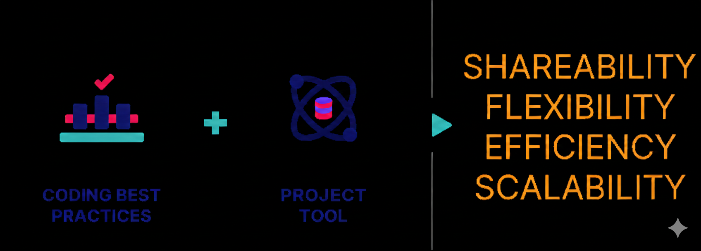
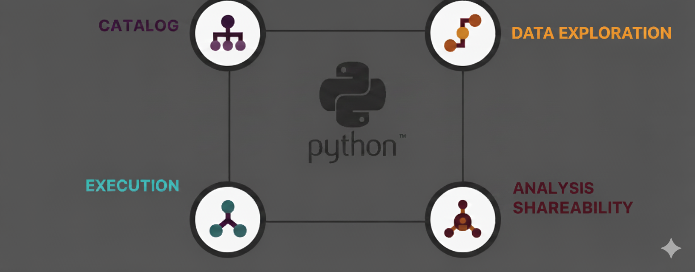

# ProjectCompass

## Overview


ProjectCompass is a user-friendly Python-based tool developed to address common challenges encountered beyond the initial creation of data analyses or projects. After completing significant analytical work, three critical questions often emerge:

- **How can we effectively organize and categorize these analyses or projects?**
- **How can we ensure accessible and standardized documentation for everyone involved?**
- **How can we consistently execute processes or pipelines within a common, reliable environment?**

Initially exploring various organizational structures (by product, owner, or project type), we developed a flexible **tag-based structure** enabling comprehensive searching and sorting across all relevant dimensions. The platform centralizes all associated documents, presentations, and versions to foster shareable knowledge while providing a unified execution environment.



## Core Functionalities


ProjectCompass performs four primary functions:

### 📂 **Catalog**
The core functionality that collects all available analyses and projects with comprehensive information and documentation, automatically extracting valuable details such as:
- Queries and technical requirements
- Metadata and project specifications  
- Tag-based flexible organization
- Cross-dimensional searching and sorting

### 🔍 **Data Exploration & Storage Tools**
Allows users to perform exploratory analyses directly within specified saved data environments:
- Interactive analysis environment
- Direct integration with data storage
- Results persistence in the same environment
- Seamless data workflow management

### ⚙️ **Execution Engine**
Enables consistent launching of analyses that produce physical outputs:
- Reports and data extractions generation
- Complex workflow execution using existing API integrations
- Environment compatibility management
- Consistent process execution

### 🔗 **Analysis Shareability**
Facilitates easy sharing of generated analyses, reports, and data extractions:
- Internal stakeholder communication via integrated channels
- Tracking of consumption and feedback on shared outputs
- Collaborative analysis review and distribution
- Stakeholder engagement monitoring



## Installation

```bash
# Clone the repository
git clone <repository-url>
cd ProjectCompass

# Install dependencies
pip install -r requirements.txt
```

## Configuration

1. Set up your project directory structure
2. Configure `basefun.py` with your environment settings
3. Update Flask secret key and CORS settings in `app.py`
4. Configure GitLab integration (optional)

## Usage

### Starting the Application

```bash
python app.py
```

The application will be available at `http://127.0.0.1:<port>`

### Main Routes

- `/` - Dashboard with project statistics and overview
- `/overview` - Detailed platform description and capabilities
- `/list_of_data/` - Data management interface
- `/produce_analysis/` - Analysis creation and upload

### Project Structure

```
ProjectCompass/
├── app.py                 # Main Flask application
├── basefun.py            # Core ProjectCompass class
├── Templates/            # HTML templates
├── static/              # Static assets (CSS, JS, images)
├── Analyses/            # Analysis storage directory
└── requirements.txt     # Python dependencies
```

## Key Components

### ProjectCompass Class
Core functionality including:
- Analysis reading and writing
- HTML template substitution
- Environment configuration
- Data encryption and compression

### Flask Web Interface
- Responsive web UI
- Multi-step forms for analysis upload
- Real-time project statistics
- Interactive dashboards

## Features in Detail

### Analysis Management
- **Upload**: Multi-step form for comprehensive analysis documentation
- **Categorization**: Tag-based flexible organization system
- **Search**: Cross-dimensional filtering by product, owner, date, tags
- **Documentation**: Automatic metadata extraction and standardization
- **Shareability**: Integrated communication and feedback tracking

### Security
- Session management with automatic reset
- CORS configuration for secure embedding
- Data encryption for sensitive information
- GitLab integration for version control

### Visualization
- Dynamic charts for project statistics
- Product distribution analytics
- Timeline visualizations
- Owner and collaboration metrics

## Configuration Options

### Environment Variables
- `use_gitlab_repo`: Enable/disable GitLab integration
- `username`: Default user configuration
- Port and directory configurations

### CORS Settings
```python
CORS(app, resources={r"/*": {"origins": ["https://your-domain.com"]}})
```

## Development

### Adding New Features
1. Extend the `ProjectCompass` class in `basefun.py`
2. Add new routes in `app.py`
3. Create corresponding HTML templates
4. Update static assets as needed

### Database Integration
The system uses file-based storage but can be extended with database backends for larger deployments.

## Troubleshooting

### Common Issues
- **Session Reset**: Sessions automatically clear on application restart
- **GitLab Lock Files**: Automatic cleanup of `.git/index.lock`
- **Port Conflicts**: Configure custom port in constants

### Logging
Application uses Python logging with Gunicorn integration for production deployments.

## Contributing

1. Fork the repository
2. Create a feature branch
3. Make your changes
4. Submit a pull request

## License

Copyright ©2024 ProjectCompass. All rights reserved. Confidential and Proprietary.

## Docker Deployment

### Quick Start with Docker Compose

```bash
# Start both ProjectCompass and Ollama
docker-compose up -d

# View logs
docker-compose logs -f

# Stop services
docker-compose down
```

### Manual Docker Setup

```bash
# Build and run with automatic Ollama setup
./docker_build_and_run.sh

# Or setup only Ollama
./setup_ollama.sh
```

### Docker Services

#### ProjectCompass Application
- **Port**: 8080 (external) → 5000 (internal)
- **Volumes**: 
  - `./Analyses` → `/app/Analyses` (persistent data)
  - `./logs` → `/app/log` (application logs)
- **Environment**: Production mode with Gunicorn

#### Ollama LLM Service
- **Port**: 11434 (LLM API)
- **Models**: 
  - `llama3` (Large Language Model)
  - `nomic-embed-text` (Embedding Model)
- **Volume**: `ollama_data` (persistent model storage)

### Docker Commands

```bash
# View application logs
docker logs projectcompass_app

# View Ollama logs
docker logs ollama

# Access application container
docker exec -it projectcompass_app bash

# Test Ollama API
curl http://localhost:11434/api/tags

# Stop all containers
docker stop projectcompass_app ollama

# Remove containers
docker rm projectcompass_app ollama

# Remove volumes (WARNING: deletes all data)
docker volume rm ollama_data
```

### Production Considerations

- **Resource Requirements**: Ollama requires significant RAM (8GB+ recommended)
- **Model Storage**: LLM models require several GB of disk space
- **Network**: Ensure ports 8080 and 11434 are available
- **Backup**: Regularly backup `./Analyses` directory and `ollama_data` volume

## Support

For issues and questions, please refer to the project documentation or contact the development team.

---

**ProjectCompass** - *Organization Is Everything®*